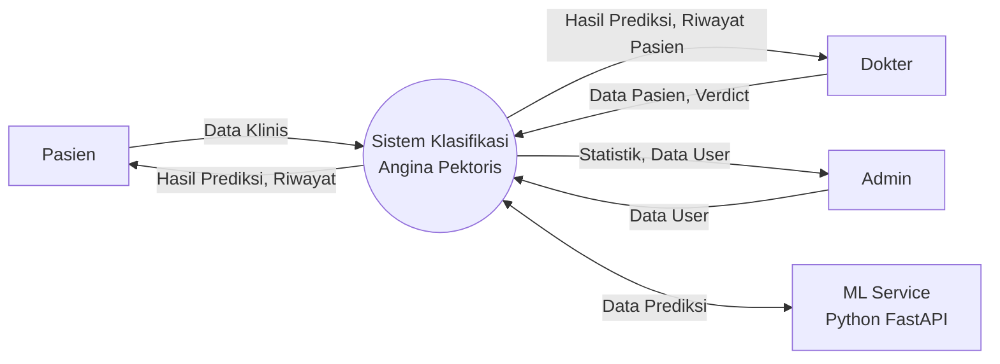

# DFD (Data Flow Diagram)

## DFD Level 0 — Context Diagram



## DFD Level 1

```mermaid
flowchart TD
    subgraph External["External Entities"]
        P[Pasien]
        D[Dokter]
        A[Admin]
        ML["ML Service<br/>Python FastAPI"]
    end

    subgraph Processes["Proses"]
        P1["1.0<br/>Manajemen<br/>Autentikasi"]
        P2["2.0<br/>Klasifikasi<br/>Angina Pektoris"]
        P3["3.0<br/>Manajemen<br/>Data Pasien"]
        P4["4.0<br/>Verdict Dokter"]
        P5["5.0<br/>Manajemen User"]
        P6["6.0<br/>Riwayat dan Laporan"]
    end

    subgraph Stores["Data Stores"]
        DS1[("DS1 users")]
        DS2[("DS2 patients")]
        DS3[("DS3 predictions")]
    end

    P -->|"Login/Register"| P1
    D -->|"Login"| P1
    A -->|"Login"| P1
    P1 -->|"User Data"| DS1
    P1 -->|"Session"| P
    P1 -->|"Session"| D
    P1 -->|"Session"| A

    P -->|"Data Klinis"| P2
    P2 -->|"Simpan Pasien"| DS2
    P2 -->|"Data Klinis"| ML
    ML -->|"Hasil Prediksi"| P2
    P2 -->|"Simpan Prediksi"| DS3
    P2 -->|"Hasil Prediksi"| P

    D -->|"CRUD Pasien"| P3
    A -->|"CRUD Pasien"| P3
    P3 -->|"Data Pasien"| DS2
    P3 -->|"Konfirmasi"| D
    P3 -->|"Konfirmasi"| A

    D -->|"Verdict + Catatan"| P4
    P4 -->|"Update Prediksi"| DS3
    P4 -->|"Baca User"| DS1

    A -->|"CRUD User"| P5
    P5 -->|"Baca/Tulis"| DS1
    P5 -->|"Konfirmasi"| A

    P -->|"Lihat Riwayat"| P6
    D -->|"Lihat Riwayat"| P6
    A -->|"Lihat Riwayat"| P6
    P6 -->|"Baca Prediksi"| DS3
    P6 -->|"Baca Pasien"| DS2
    P6 -->|"Laporan"| P
    P6 -->|"Laporan"| D
    P6 -->|"Laporan"| A
