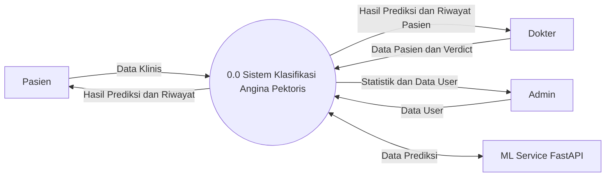
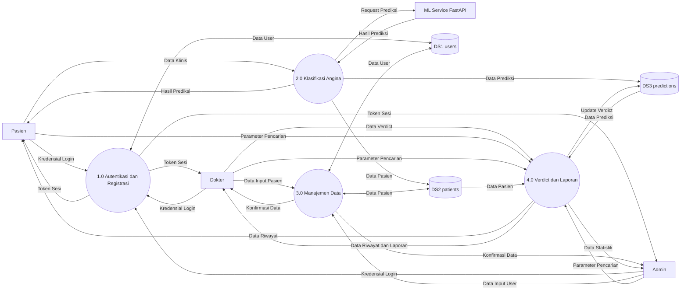

# DFD (Data Flow Diagram)

## DFD Level 0 — Context Diagram

**Gambaran Besar:**

DFD Level 0 (Context Diagram) menggambarkan Sistem Klasifikasi Angina Pektoris sebagai satu proses utuh yang berinteraksi dengan empat entitas eksternal: Pasien, Dokter, Admin, dan ML Service FastAPI. Pasien mengirimkan data klinis ke sistem dan menerima kembali hasil prediksi beserta riwayat klasifikasi. Dokter mengirimkan data pasien dan verdikt, serta menerima hasil prediksi dan riwayat pasien. Admin mengelola data pengguna dan menerima statistik sistem serta data user. ML Service FastAPI berperan sebagai layanan prediksi eksternal yang menerima data klinis dari sistem dan mengembalikan hasil prediksi angina pektoris. Diagram ini memberikan pandangan tingkat tinggi mengenai batas sistem, entitas yang berinteraksi, dan arus data yang mengalir masuk dan keluar tanpa menunjukkan detail proses internal.

**Keterangan Simbol DFD:**

| Simbol | Bentuk | Keterangan |
|--------|--------|------------|
| `[...]` | Persegi Panjang | Entitas Eksternal |
| `((...))` | Lingkaran | Proses |
| `[(...)]` | Silinder | Data Store |
| `-->` | Panah | Arus Data |

---

## DFD Level 1

**Gambaran Besar:**

DFD Level 1 mendekomposisi sistem menjadi empat proses utama yang menjelaskan alur data secara lebih rinci. **Proses 1.0 (Autentikasi dan Registrasi)** menerima kredensial login dari seluruh pengguna (Pasien, Dokter, Admin), memverifikasi data pada DS1 users, lalu mengembalikan token sesi untuk akses sistem. **Proses 2.0 (Klasifikasi Angina)** merupakan fitur inti sistem, di mana Pasien mengirimkan data klinis yang kemudian diteruskan ke ML Service FastAPI untuk diprediksi. Hasil prediksi beserta data pasien disimpan ke DS2 patients dan DS3 predictions, lalu dikembalikan kepada Pasien. **Proses 3.0 (Manajemen Data)** menangani pengelolaan data pasien oleh Dokter dan data pengguna oleh Admin, dengan membaca serta menulis ke DS1 users dan DS2 patients. **Proses 4.0 (Verdict dan Laporan)** menangani pemberian verdikt oleh Dokter terhadap hasil prediksi, serta menyediakan riwayat klasifikasi dan laporan untuk seluruh role pengguna. Proses ini membaca data dari DS2 patients dan DS3 predictions, memperbarui verdikt pada DS3 predictions, dan mengembalikan data riwayat, laporan, serta statistik kepada masing-masing pengguna. Seluruh proses ini bekerja secara terintegrasi dengan tiga data store sebagai penyimpanan data utama sistem.

**Keterangan Proses:**

| No | Proses | Deskripsi | Input | Output |
|----|--------|-----------|-------|--------|
| 1.0 | Autentikasi dan Registrasi | Login, register, verifikasi, buat sesi | Kredensial Login | Token Sesi |
| 2.0 | Klasifikasi Angina | Input data klinis, prediksi ML, simpan hasil | Data Klinis | Hasil Prediksi |
| 3.0 | Manajemen Data | CRUD data pasien dan akun pengguna | Data Input Pasien/User | Konfirmasi Data |
| 4.0 | Verdict dan Laporan | Verdict dokter, riwayat klasifikasi, laporan | Data Verdict, Parameter Pencarian | Data Riwayat/Laporan |

**Keterangan Data Store:**

| Data Store | Isi | Proses Pengakses |
|------------|-----|------------------|
| DS1 users | Data akun pengguna (name, email, password, role) | 1.0 (baca/tulis), 3.0 (baca/tulis) |
| DS2 patients | Data pasien (nama, no_urut, umur, jenis_kelamin) | 2.0 (tulis), 3.0 (baca/tulis), 4.0 (baca) |
| DS3 predictions | Data prediksi (data klinis, hasil, verdikt) | 2.0 (tulis), 4.0 (baca/tulis) |
