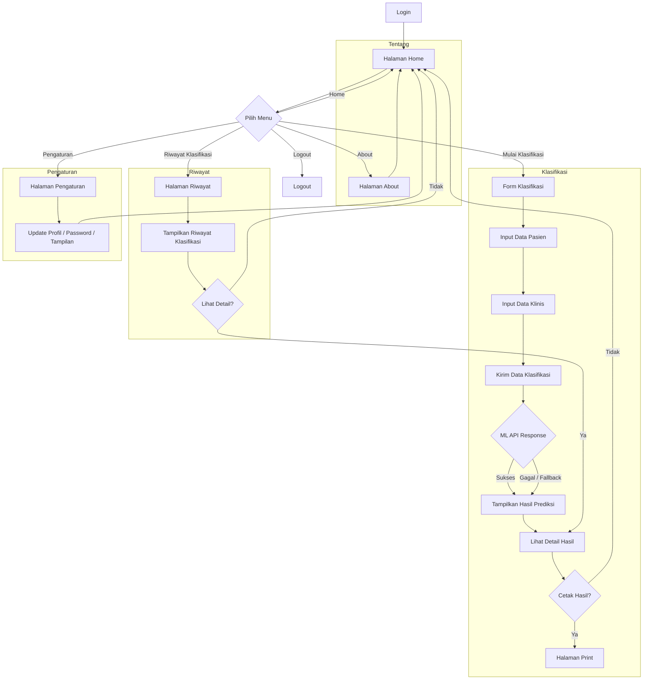
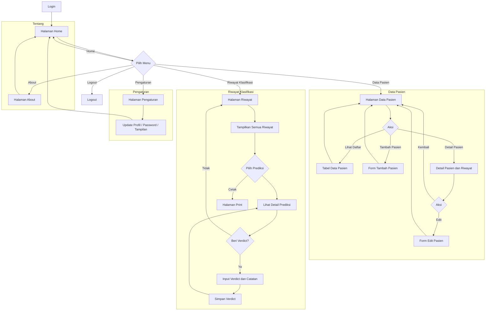
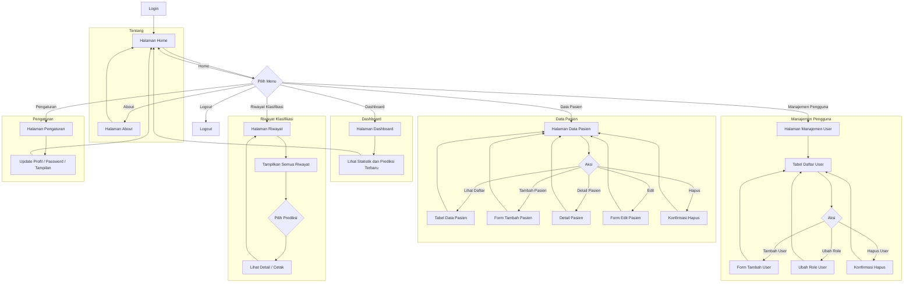

# Flowchart Sistem — Per User

## Flowchart Pasien (Patient)

```mermaid
flowchart TD
    A[Login] --> B[Halaman Home]
    B --> C{Pilih Menu}

    C -->|About| D
    C -->|Mulai Klasifikasi| E
    C -->|Riwayat Klasifikasi| F
    C -->|Pengaturan| G
    C -->|Home| B
    C -->|Logout| Z[Logout]

    subgraph about[Tentang]
        D[Halaman About]
        D --> B
    end

    subgraph klasifikasi[Klasifikasi]
        E[Form Klasifikasi] --> E1[Input Data Pasien]
        E1 --> E2[Input Data Klinis]
        E2 --> E3[Kirim Data Klasifikasi]
        E3 --> E4{ML API Response}
        E4 -->|Sukses| E5[Tampilkan Hasil Prediksi]
        E4 -->|Gagal / Fallback| E5
        E5 --> E6[Lihat Detail Hasil]
        E6 --> E7{Cetak Hasil?}
        E7 -->|Ya| E8[Halaman Print]
        E7 -->|Tidak| B
    end

    subgraph riwayat[Riwayat]
        F[Halaman Riwayat] --> F1[Tampilkan Riwayat Klasifikasi]
        F1 --> F2{Lihat Detail?}
        F2 -->|Ya| E6
        F2 -->|Tidak| B
    end

    subgraph pengaturan[Pengaturan]
        G[Halaman Pengaturan] --> G1[Update Profil / Password / Tampilan]
        G1 --> B
    end
```

## Flowchart Dokter (Doctor)

```mermaid
flowchart TD
    A[Login] --> B[Halaman Home]
    B --> C{Pilih Menu}

    C -->|About| D
    C -->|Data Pasien| E
    C -->|Riwayat Klasifikasi| F
    C -->|Pengaturan| G
    C -->|Home| B
    C -->|Logout| Z[Logout]

    subgraph about[Tentang]
        D[Halaman About]
        D --> B
    end

    subgraph datapasien[Data Pasien]
        E[Halaman Data Pasien] --> E1{Aksi}
        E1 -->|Lihat Daftar| E2[Tabel Data Pasien]
        E1 -->|Tambah Pasien| E3[Form Tambah Pasien]
        E1 -->|Detail Pasien| E4[Detail Pasien dan Riwayat]
        E2 --> E
        E3 --> E
        E4 --> E5{Aksi}
        E5 -->|Edit| E6[Form Edit Pasien]
        E5 -->|Kembali| E
        E6 --> E
    end

    subgraph riwayat[Riwayat Klasifikasi]
        F[Halaman Riwayat] --> F1[Tampilkan Semua Riwayat]
        F1 --> F2{Pilih Prediksi}
        F2 --> F3[Lihat Detail Prediksi]
        F3 --> F4{Beri Verdict?}
        F4 -->|Ya| F5[Input Verdict dan Catatan]
        F5 --> F6[Simpan Verdict]
        F6 --> F3
        F4 -->|Tidak| F
        F2 -->|Cetak| F7[Halaman Print]
    end

    subgraph pengaturan[Pengaturan]
        G[Halaman Pengaturan] --> G1[Update Profil / Password / Tampilan]
        G1 --> B
    end
```

## Flowchart Admin

```mermaid
flowchart TD
    A[Login] --> B[Halaman Home]
    B --> C{Pilih Menu}

    C -->|About| D
    C -->|Dashboard| E
    C -->|Data Pasien| F
    C -->|Riwayat Klasifikasi| G
    C -->|Manajemen Pengguna| H
    C -->|Pengaturan| I
    C -->|Home| B
    C -->|Logout| Z[Logout]

    subgraph about[Tentang]
        D[Halaman About]
        D --> B
    end

    subgraph dashboard[Dashboard]
        E[Halaman Dashboard] --> E1[Lihat Statistik dan Prediksi Terbaru]
        E1 --> B
    end

    subgraph datapasien[Data Pasien]
        F[Halaman Data Pasien] --> F1{Aksi}
        F1 -->|Lihat Daftar| F2[Tabel Data Pasien]
        F1 -->|Tambah Pasien| F3[Form Tambah Pasien]
        F1 -->|Detail Pasien| F4[Detail Pasien]
        F1 -->|Edit| F5[Form Edit Pasien]
        F1 -->|Hapus| F6[Konfirmasi Hapus]
        F2 --> F
        F3 --> F
        F4 --> F
        F5 --> F
        F6 --> F
    end

    subgraph riwayat[Riwayat Klasifikasi]
        G[Halaman Riwayat] --> G1[Tampilkan Semua Riwayat]
        G1 --> G2{Pilih Prediksi}
        G2 --> G3[Lihat Detail / Cetak]
        G3 --> G
    end

    subgraph manajemen[Manajemen Pengguna]
        H[Halaman Manajemen User] --> H1[Tabel Daftar User]
        H1 --> H2{Aksi}
        H2 -->|Tambah User| H3[Form Tambah User]
        H2 -->|Ubah Role| H4[Ubah Role User]
        H2 -->|Hapus User| H5[Konfirmasi Hapus]
        H3 --> H1
        H4 --> H1
        H5 --> H1
    end

    subgraph pengaturan[Pengaturan]
        I[Halaman Pengaturan] --> I1[Update Profil / Password / Tampilan]
        I1 --> B
    end
```
